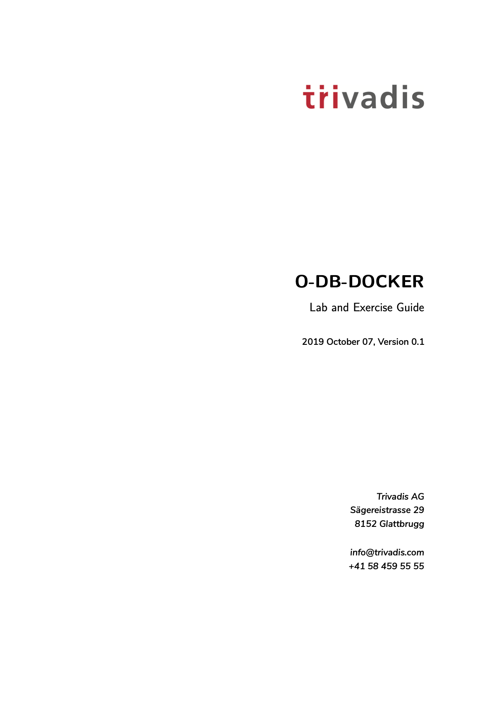

# Pandoc Template

A **pandoc LaTeX template** to convert markdown files to PDF or LaTeX using a
TeX template CI. It is designed for lecture notes and exercises with a focus on
computer science. The template is compatible with *Pandoc* 2.

## Preview

A custom title page      |  A basic example page
:-------------------------:|:-------------------------:
[](examples/O-DB-DOCKER_Lab_and_Exercise_Guide.pdf)  |  [](examples/O-DB-DOCKER_Lab_and_Exercise_Guide.pdf)

## Installation

1. Install pandoc from <http://pandoc.org/>. You also need to install
   [LaTeX](https://en.wikibooks.org/wiki/LaTeX/Installation#Distributions).
2. Move the template `oradba.tex` to your *Pandoc* templates folder and rename
   the file to `oradba.latex`.The location of the templates folder depends on
   your operating system:

   - Unix, Linux, macOS: `~/.pandoc/templates/`
   - Windows XP: `C:\Documents And Settings\USERNAME\Application Data\pandoc`
   - Windows Vista or later: `C:\Users\USERNAME\AppData\Roaming\pandoc`

If there are no folders called `templates` or `pandoc` you need to create them
and put the template `oradba.latex` inside.

Alternatively you can keep using the `oradba.tex` without putting it to the
user defined template folder. In this case you just have to add the template via
command line parameter e.g. `--template oradba.tex`.

- Use template from the custom template folder `--template oradba`.
- Provide the template via command line parameter `--template oradba.tex`.

The following examples will use the OraDBA template from the custom template
folder. If you have not copy the template as described above, you will have to
adapt the commands and explicitly provide the path to the template.

## Logo

The OraDBA *Pandoc* template does use a company logo. By default it will lock
for the file `images/logo.eps` in your current folder. The PDF
conversion via Latex will fail, if the file does not exist. There are a couple
of option to provide a logo.

1. Provide the logo in a local image folder e.g. `images/logo.eps`
2. Specify a logo via command line parameter by adding pandoc variable
   parameter `-V KEY[=VAL]` respectively `--variable=KEY[:VAL]`

    ```bash
    pandoc examples/test.md -o examples/test.pdf --template oradba --listings -V logo=images/logo.eps
    pandoc examples/test.md -o examples/test.pdf --template oradba --listings --variable=logo:images/logo.eps
    ```

3. The simples method is to add the logo in the metadata of you markdown file.
   There you just have to provide the relative path you the logo.

```markdown
---
title: "The Document Title"
author: [Example Author, Another Author]
date: "2017-02-20"
logo: images/logo.eps
---
```

## Usage

1. Open the terminal and navigate to the folder where your markdown file is located.
2. Execute the following command

    ```bash
    pandoc examples/test.md -o examples/test.pdf --from markdown --template oradba --listings
    ```

    where `test.md` is the markdown file you want to convert to PDF.

In order to have nice headers and footers you need to supply metadata to your
document. You can do that with a
[YAML metadata block](http://pandoc.org/MANUAL.html#extension-yaml_metadata_block)
at the top of your markdown document (see the
[example markdown file](examples/basic-example/basic-example.md)). Your markdown
document may look like the following:

```markdown
---
title: "The Document Title"
author: [Example Author, Another Author]
date: "2017-02-20"
keywords: [Markdown, Example]
---

Here is the actual document text...
```

### Custom Template Variables

This template defines some new variables to control the appearance of the title
page. The existing template variables from pandoc are all supported and their
documentation can be found in [the pandoc manual](https://pandoc.org/MANUAL.html#variables-for-latex).

- `titlepage` (defaults to `false`)
  turns on the title page when `true`
- `titlepage-color`
  the background color of the title page. The color value must be given as an HTML hex color like `D8DE2C` without the leading number sign (`#`). When specifying the color in YAML, it is advisable to enclose it in quotes like so `titlepage-color: "D8DE2C"` to avoid the truncation of the color (e.g. `000000` becoming `0`).
- `titlepage-text-color` (defaults to `5F5F5F`)
  the text color of the title page
- `titlepage-rule-color` (defaults to `435488`)
  the color of the rule on the top of the title page
- `titlepage-rule-height` (defaults to `4`)
  the height of the rule on the top of the title page (in points)
- `caption-justification` (defaults to `raggedright`)
  justification setting for captions (uses the `justification` parameter of the [caption](https://ctan.org/pkg/caption?lang=en) package)
- `toc-own-page` (defaults to `false`)
  begin new page after table of contents, when `true`
- `listings-disable-line-numbers` (defaults to `false`)
  disables line numbers for all listings
- `title-color` (defaults to `000000`)
  Colour of the document title
- `subtitle-color` (defaults to `A100FF`)
  Colour of the document subtitle
- `disable-header-and-footer` (default to `false`)
  disables the header and footer completely on all pages
- `disable-header` (default to `false`)
  disables the header completely on all pages
- `disable-footer` (default to `false`)
  disables the footer completely on all pages
- `header-left` (defaults to the title)
  the text on the left side of the header
- `header-center`
  the text in the center of the header
- `header-right` (defaults to the date)
  the text on the right side of the header
- `footer-left` (defaults to the author)
  the text on the left side of the footer
- `footer-center`
  the text in the center of the footer
- `footer-right` (defaults to the page number)
  the text on the right side of the footer
- `book` (defaults to `false`)
  typeset as book
- `logo`
  path to an image that will be displayed on the title page. The path is always
  relative to where pandoc is executed. The option `--resource-path` has no effect.
- `logo-width` (defaults to `100`)
  the width of the logo (in points)

## Examples

### Syntax Highlighting with Listings

You can get syntax highlighting of delimited code blocks by using the LaTeX
package listings with the option `--listings`. This example will produce the
same syntax highlighting as in the example PDF.

```bash
pandoc examples/test.md -o examples/test.pdf --template oradba --listings
```

### Syntax Highlighting Without Listings

The following examples show [syntax highlighting of delimited code blocks](http://pandoc.org/MANUAL.html#syntax-highlighting)
without using listings. To see a list of all the supported highlight styles, type
`pandoc --list-highlight-styles`.

```bash
pandoc examples/test.md -o examples/test.pdf --template oradba --highlight-style pygments
```

### Standalone LaTeX Document

To produce a standalone LaTeX document for compiling with any LaTeX editor use
`.tex` as an output file extension.

```bash
pandoc examples/test.md -o examples/test.tex --template oradba
```

### Changing the Document Language

The default language of this template is American English. The `lang` variable
identifies the main language of the document, using a code according to
[BCP 47](https://tools.ietf.org/html/bcp47) (e.g. `en` or `en-GB`). For an
incomplete list of the supported language codes see
[the documentation for the hyph-utf8 package (Section 2)](http://mirrors.ctan.org/language/hyph-utf8/doc/generic/hyph-utf8/hyph-utf8.pdf).
The following example changes the language to British English:

```bash
pandoc examples/test.md -o examples/test.pdf --template oradba -V lang=en-GB
```

The following example changes the language to German:

```bash
pandoc examples/test.md -o examples/test.pdf --template oradba -V lang=de
```

### Typesetting a Book

To typeset a book supply the template variable `-V book`.

To get the correct chapter headings you need to tell pandoc that it should convert
first level headings (indicated by one `#` in markdown) to chapters with the command
line option `--top-level-division=chapter`.

There will be one blank page before each chapter because the template is two-sided
per default. So if you plan to publish your book as a PDF and don't need a blank
page you should add the class option `onesided` which can be done by supplying a
template variable `-V classoption=oneside`.

## Issues

Please file your bug reports, enhancement requests, questions and other support
requests within [Github's issue tracker](https://help.github.com/articles/about-issues/):

- [Existing issues](https://github.com/oehrlis/pandoc_template/issues)
- [submit new issue](https://github.com/oehrlis/pandoc_template/issues/new)

## References

- [pandoc](https://pandoc.org)
- [texlive 2018](https://www.tug.org/texlive/)

## Credits

- This template is based on the `eisvogel.tex` template from
  [pandoc-letter](https://github.com/Wandmalfarbe/pandoc-latex-template) by [Aaron Wandmalfarbe](https://github.com/Wandmalfarbe).
- This template includes code for styling block quotations from
  [pandoc-letter](https://github.com/aaronwolen/pandoc-letter) by [Aaron Wolen](https://github.com/aaronwolen).

## License

This project is open source licensed under the GNU General Public License v3.0.
You may obtain a copy of the License at <https://www.gnu.org/licenses/gpl.html>.
