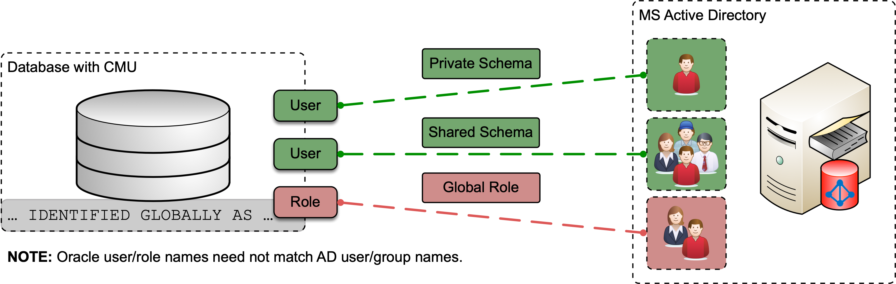

# Formatting Examples
<!-- markdownlint-configure-file { "MD013": { "tables": false } } -->
<!-- markdownlint-configure-file { "MD024": {"allow_different_nesting": true}} -->
<!-- markdownlint-configure-file { "MD036": } -->

## Basic Syntax

These are the elements outlined in John Gruber’s original design document. All
Markdown applications support these elements.

### Heading

Headings are created with a `#`. Where the number of `#` corresponds to the
level of the heading.

```markdown
# This is an <h1> tag
## This is an <h2> tag
### This is an <h3> tag
```

### Emphasis

```markdown
*This text will be italic*
_This will also be italic_

**This text will be bold**
__This will also be bold__

_You **can** combine them_
```

*This text will be italic*
_This will also be italic_

**This text will be bold**
__This will also be bold__

_You **can** combine them_

### Blockquote

```markdown
> blockquote
```

> blockquote

### Ordered List

1. First item
2. Second item
3. Third item

### Unordered List

- First item
- Second item
- Third item

### Code

`code`

### Horizontal Rule

---

### Link

[title](https://www.example.com)

### Image



## Extended Syntax

These elements extend the basic syntax by adding additional features. Not all
Markdown applications support these elements.

### Table

| Syntax | Description |
| ----------- | ----------- |
| Header | Title |
| Paragraph | Text |

### Fenced Code Block

```JSON
{
  "firstName": "John",
  "lastName": "Smith",
  "age": 25
}
```

### Footnote

Here's a sentence with a footnote. [^1]

[^1]: This is the footnote.

### Heading ID

### My Great Heading {#custom-id}

### Definition List

term
: definition For a list of all available boxes and options visit theFor a list
  of all available boxes and options visit theFor a list of all available boxes
  and options visit the

### Strikethrough

~~The world is flat.~~

### Task List

- [x] Write the press release
- [ ] Update the website
- [ ] Contact the media

## Box Types

For a list of all available boxes and options visit the
[`awesomebox` documentation](https://ctan.org/pkg/awesomebox).

```markdown
::: note
**Note** Lorem ipsum dolor ...
:::
```

::: note
Lorem ipsum dolor sit amet, consectetur adipiscing elit. Nam aliquet libero
quis lectus elementum fermentum.

Fusce aliquet augue sapien, non efficitur mi ornare sed. Morbi at dictum
felis. Pellentesque tortor lacus, semper et neque vitae, egestas commodo nisl.
:::

```markdown
::: tip
**Tip** Lorem ipsum dolor ...
:::
```

::: tip
**Tip** Lorem ipsum dolor sit amet, consectetur adipiscing elit. Nam aliquet
libero quis lectus elementum fermentum.

Fusce aliquet augue sapien, non efficitur mi ornare sed. Morbi at dictum
felis. Pellentesque tortor lacus, semper et neque vitae, egestas commodo nisl.
:::

```markdown
::: warning
**Warning** Lorem ipsum dolor ...
:::
```

::: warning
**Warning** Lorem ipsum dolor sit amet, consectetur adipiscing elit. Nam aliquet
libero quis lectus elementum fermentum.

Fusce aliquet augue sapien, non efficitur mi ornare sed. Morbi at dictum
felis. Pellentesque tortor lacus, semper et neque vitae, egestas commodo nisl.
:::

```caution
::: warning
**Caution** Lorem ipsum dolor ...
:::
```

::: caution
**Caution** Lorem ipsum dolor sit amet, consectetur adipiscing elit. Nam aliquet
libero quis lectus elementum fermentum.

Fusce aliquet augue sapien, non efficitur mi ornare sed. Morbi at dictum
felis. Pellentesque tortor lacus, semper et neque vitae, egestas commodo nisl.
:::

```markdown
::: important
**Important** Lorem ipsum dolor ...
:::
```

::: important
**Important** Lorem ipsum dolor sit amet, consectetur adipiscing elit. Nam
aliquet libero quis lectus elementum fermentum.

Fusce aliquet augue sapien, non efficitur mi ornare sed. Morbi at dictum
felis. Pellentesque tortor lacus, semper et neque vitae, egestas commodo nisl.
:::

Markdown formatting inside the environments is supported.

::: important
**Lorem ipsum dolor** sit amet, `consectetur adipiscing` elit.

```JAVA
if(args.length < 2) {
    System.out.println("Lorem ipsum dolor sit amet");
}
```

*Nam aliquet libero
quis lectus elementum fermentum.*
:::

::: tvd
**Trivadis** Lorem ipsum dolor sit amet, consectetur adipiscing elit. Nam
aliquet libero quis lectus elementum fermentum.

Fusce aliquet augue sapien, non efficitur mi ornare sed. Morbi at dictum
felis. Pellentesque tortor lacus, semper et neque vitae, egestas commodo nisl.
:::

::: tvd2
**Trivadis** Lorem ipsum dolor sit amet, consectetur adipiscing elit. Nam
aliquet libero quis lectus elementum fermentum.

Fusce aliquet augue sapien, non efficitur mi ornare sed. Morbi at dictum
felis. Pellentesque tortor lacus, semper et neque vitae, egestas commodo nisl.
:::
